# TravelMemory MERN Application – AWS Deployment using Terraform and Ansible


## 1. Project Overview

This project demonstrates the deployment of the **TravelMemory MERN application** on AWS using Infrastructure as Code and configuration management.

The project uses:

- AWS
- Terraform
- Ansible
- Amazon EC2
- Amazon VPC
- Internet Gateway
- NAT Gateway
- Security Groups
- IAM
- Ubuntu
- Nginx
- Node.js
- Express
- React
- MongoDB
- Mongoose
- Git
- GitHub

The deployment consists of two EC2 instances:

1. A public Web/Application Server
2. A private Database Server

The Web Server hosts the React frontend, Node.js backend and Nginx.

The Database Server hosts MongoDB and is accessible only through the private network from the Web Server.

---

## 2. Application Architecture

The application follows the MERN architecture:

```text
React
  |
  v
Node.js / Express
  |
  v
MongoDB
```

The complete application request flow is:

```text
User Browser
     |
     | HTTP :80
     v
   Nginx
     |
     +----------------------+
     |                      |
     v                      v
React Frontend         Node.js Backend
                            |
                            | Mongoose
                            v
                       MongoDB
                            |
                            v
                    Private Database EC2
```

---

## 3. Source Application

The application used for this project is TravelMemory.

Original repository:

https://github.com/UnpredictablePrashant/TravelMemory

The application contains:

```text
TravelMemory/
├── backend/
│   ├── index.js
│   ├── conn.js
│   ├── package.json
│   └── routes/
│
└── frontend/
    ├── package.json
    └── src/
```

---

# 4. AWS Region

The deployment was performed in the Mumbai AWS region.

```text
Region:
ap-south-1

Location:
Mumbai
```

---

# 5. Final AWS Architecture

```text
                         INTERNET
                            |
                            |
                            v
                    +---------------+
                    |   Internet    |
                    |    Gateway    |
                    +-------+-------+
                            |
                            |
                 +----------v-----------+
                 |       AWS VPC        |
                 |     10.0.0.0/16      |
                 |                      |
                 |  PUBLIC SUBNET       |
                 |  10.0.1.0/24        |
                 |                      |
                 |  +----------------+  |
                 |  |    WEB EC2     |  |
                 |  |                |  |
                 |  | Nginx :80      |  |
                 |  | React          |  |
                 |  | Node.js :3001  |  |
                 |  +-------+--------+  |
                 |          |           |
                 |          | TCP 27017 |
                 |          |           |
                 |  PRIVATE SUBNET     |
                 |  10.0.2.0/24        |
                 |                      |
                 |  +----------------+  |
                 |  |  DATABASE EC2  |  |
                 |  |                |  |
                 |  | MongoDB :27017 |  |
                 |  +----------------+  |
                 |                      |
                 +----------------------+
```

---

# 6. Project Objectives

The objectives of this project are:

1. Create AWS infrastructure using Terraform.
2. Create a custom VPC.
3. Create public and private subnets.
4. Configure an Internet Gateway.
5. Configure a NAT Gateway.
6. Configure public and private route tables.
7. Create Web and Database Security Groups.
8. Create IAM roles.
9. Deploy two EC2 instances.
10. Configure the EC2 instances using Ansible.
11. Install Node.js and npm.
12. Deploy the TravelMemory application.
13. Install MongoDB.
14. Secure MongoDB using authentication.
15. Create a dedicated MongoDB application user.
16. Configure backend-to-database connectivity.
17. Configure the Node.js backend as a systemd service.
18. Build the React frontend.
19. Configure Nginx.
20. Configure Nginx as a reverse proxy.
21. Test the application end-to-end.
22. Verify database writes and reads.
23. Document the complete deployment.

---

# 7. Project Directory Structure

The final project structure is:

```text
travelmemory-aws-terraform-ansible/
│
├── terraform/
│   ├── provider.tf
│   ├── variables.tf
│   ├── vpc.tf
│   ├── subnet.tf
│   ├── route_tables.tf
│   ├── nat.tf
│   ├── security_groups.tf
│   ├── iam.tf
│   ├── ec2.tf
│   └── outputs.tf
│
├── ansible/
│   ├── ansible.cfg
│   ├── inventory.ini
│   ├── web-server.yml
│   ├── mongodb-server.yml
│   ├── backend-service.yml
│   └── nginx-travelmemory.conf
│
├── screenshots/
│
├── .gitignore
├── .terraform.lock.hcl
├── README.md
└── repository-link.txt
```

---

# 8. Prerequisites

The following tools were used during the deployment:

```text
AWS CLI
Terraform
Ansible
Git
GitHub
SSH
WSL
```

AWS CLI authentication was configured before Terraform deployment.

AWS region:

```text
ap-south-1
```

---

# 9. Terraform Infrastructure

Terraform was used to provision the AWS infrastructure.

The Terraform configuration creates:

- VPC
- Public subnet
- Private subnet
- Internet Gateway
- NAT Gateway
- Public route table
- Private route table
- Security Groups
- IAM roles
- EC2 instances
- Terraform outputs

---

# 10. Terraform Initialization

Navigate to the Terraform directory:

```bash
cd terraform
```

Initialize Terraform:

```bash
terraform init
```

Terraform downloads the required provider and initializes the working directory.

---

# 11. Terraform Validation

Validate the Terraform configuration:

```bash
terraform validate
```

Expected result:

```text
Success! The configuration is valid.
```

Screenshot:


---

# 12. Terraform Plan

Generate the infrastructure plan:

```bash
terraform plan
```

The infrastructure had already been successfully deployed.

The final plan showed changes related to automatically managed AWS tags:

```text
Plan: 0 to add, 2 to change, 0 to destroy
```

No destructive infrastructure changes were required.

Screenshot:


---

# 13. Terraform Apply

Deploy the infrastructure:

```bash
terraform apply
```

Terraform successfully completed the deployment.

Expected result:

```text
Apply complete! Resources: 2 added, 0 changed, 0 destroyed.
```

---

# 14. VPC Configuration

The VPC created for the project is:

```text
Name:
travelmemory-vpc

CIDR:
10.0.0.0/16
```

The VPC provides the isolated AWS network for the application.

---

# 15. Public Subnet

The public subnet is:

```text
Name:
travelmemory-public-subnet

Subnet ID:
subnet-025b5aee30722777c
```

CIDR:

```text
10.0.1.0/24
```

The Web EC2 instance is deployed in this subnet.

---

# 16. Private Subnet

The private subnet is:

```text
Name:
travelmemory-private-subnet

Subnet ID:
subnet-0f322c5c330027bbe
```

CIDR:

```text
10.0.2.0/24
```

The Database EC2 instance is deployed in this subnet.

The Database EC2 does not have a public IP address.

---

# 17. Internet Gateway

The public subnet uses an Internet Gateway.

The public route is:

```text
0.0.0.0/0
    |
    v
Internet Gateway
```

This allows the Web EC2 instance to communicate with the Internet.

---

# 18. NAT Gateway

A NAT Gateway was created for the private subnet.

```text
Name:
travelmemory-nat-gateway

NAT Gateway ID:
nat-0b62680f96b62327e

Public IP:
16.4.10.144

Private IP:
10.0.1.76
```

The NAT Gateway allows private resources to initiate outbound Internet connections without making them directly accessible from the Internet.

---

# 19. Public Route Table

The public route table is:

```text
Name:
travelmemory-public-route-table

Route Table ID:
rtb-03a11fc6c9c08e262
```

Route:

```text
Destination:
0.0.0.0/0

Target:
Internet Gateway
```

The public subnet is associated with this route table.

---

# 20. Private Route Table

The private route table is:

```text
Name:
travelmemory-private-route-table

Route Table ID:
rtb-093eeb5d7482b277c
```

Route:

```text
Destination:
0.0.0.0/0

Target:
nat-0b62680f96b62327e
```

The private subnet is associated with this route table.

---

# 21. Network Flow

The final network design is:

```text
Internet
   |
   v
Internet Gateway
   |
   v
Public Subnet
   |
   v
Web EC2
   |
   | Private Network
   | TCP 27017
   v
Private Subnet
   |
   v
Database EC2
   |
   v
MongoDB
```

---

# 22. Web Security Group

The Web Security Group is:

```text
Name:
travelmemory-web-sg
```

The Web EC2 requires HTTP access and controlled SSH administration.

The application is publicly accessible through:

```text
TCP 80
```

SSH is restricted to the configured administrator source.

---

# 23. Database Security Group

The Database Security Group is:

```text
Name:
travelmemory-db-sg

Security Group ID:
sg-08c9457012e3749e
```

MongoDB access:

```text
Protocol:
TCP

Port:
27017

Source:
Web Security Group

Source Security Group:
sg-096e5f1b825bcfacd
```

This means MongoDB is not exposed directly to the public Internet.

Screenshot:


---

# 24. EC2 Instances

Two EC2 instances were created.

## Web EC2

```text
Instance ID:
i-0fd292f4e61915386

Private IP:
10.0.1.40

Public IP:
13.234.111.87

Public DNS:
ec2-13-234-111-87.ap-south-1.compute.amazonaws.com
```

## Database EC2

```text
Instance ID:
i-04cef62c1be6ff31a

Private IP:
10.0.2.54
```

The Database EC2 does not have a public IP.

---

# 25. Terraform Outputs

Final Terraform outputs:

```text
database_instance_id = "i-04cef62c1be6ff31a"

database_private_ip = "10.0.2.54"

web_instance_id = "i-0fd292f4e61915386"

web_server_private_ip = "10.0.1.40"

web_server_public_dns = "ec2-13-234-111-87.ap-south-1.compute.amazonaws.com"

web_server_public_ip = "13.234.111.87"
```

---

# 26. SSH Key Management

The AWS private key is stored outside the project:

```text
~/.ssh/travelmemory-key.pem
```

SSH access to the Web EC2:

```bash
ssh -i ~/.ssh/travelmemory-key.pem ubuntu@13.234.111.87
```

The private key is not stored inside the Git repository.

---

# 27. Ansible Configuration

Ansible was used for server configuration and application deployment.

Ansible project files:

```text
ansible/
├── ansible.cfg
├── inventory.ini
├── web-server.yml
├── mongodb-server.yml
├── backend-service.yml
└── nginx-travelmemory.conf
```

---

# 28. Ansible Inventory

The inventory contains two groups:

```ini
[web]
web-server ansible_host=13.234.111.87 ansible_user=ubuntu ansible_ssh_private_key_file=~/.ssh/travelmemory-key.pem

[database]
database-server ansible_host=10.0.2.54 ansible_user=ubuntu ansible_ssh_private_key_file=~/.ssh/travelmemory-key.pem ansible_ssh_common_args='-o ProxyJump=travelmemory-web'
```

The Web EC2 is accessed directly.

The Database EC2 is accessed through the Web EC2 using SSH ProxyJump.

---

# 29. Ansible Connectivity Test

Test connectivity:

```bash
ANSIBLE_CONFIG=$PWD/ansible.cfg ansible web -m ping
```

Test the Database EC2:

```bash
ANSIBLE_CONFIG=$PWD/ansible.cfg ansible database -m ping
```

Both hosts successfully responded.

Final Ansible validation:


---

# 30. Web Server Configuration

The Web Server was configured using Ansible.

The playbook installs:

- Git
- Node.js
- npm
- Application dependencies

The TravelMemory application was cloned to:

```text
/opt/TravelMemory
```

---

# 31. Node.js Installation

Node.js was installed on the Web EC2.

Version:

```text
v20.20.2
```

npm version:

```text
10.8.2
```

The application backend and frontend dependencies were installed using npm.

---

# 32. TravelMemory Application Deployment

The application was cloned:

```bash
cd /opt
git clone https://github.com/UnpredictablePrashant/TravelMemory.git
```

Application directory:

```text
/opt/TravelMemory
```

The application contains:

```text
backend/
frontend/
```

---

# 33. Backend Dependencies

Backend dependencies were installed:

```bash
cd /opt/TravelMemory/backend
npm install
```

The backend dependencies installed successfully.

The project was not modified using:

```bash
npm audit fix --force
```

because forced dependency updates can introduce breaking changes.

---

# 34. MongoDB Installation

MongoDB was installed on the private Database EC2.

MongoDB was configured as a system service.

The final MongoDB version was:

```text
8.0.32
```

MongoDB service status was verified successfully.

Screenshot:

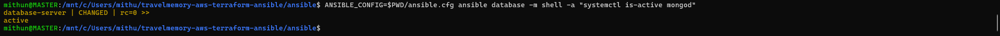

---

# 35. MongoDB Kernel Compatibility

During MongoDB installation, the original AWS kernel was incompatible with MongoDB 8.

A compatible AWS kernel was installed:

```text
6.8.0-1064-aws
```

The system was configured to boot using the compatible kernel.

Final kernel:

```text
6.8.0-1064-aws
```

Screenshot:


---

# 36. MongoDB Network Configuration

MongoDB listens on:

```text
127.0.0.1:27017
10.0.2.54:27017
```

This allows:

- Local MongoDB access
- Private network access from the Web EC2

MongoDB is not publicly exposed.

Screenshot:

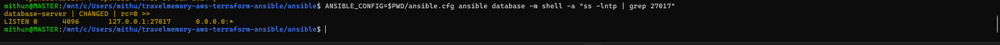

---

# 37. MongoDB Authentication

MongoDB authentication was enabled.

An administrative MongoDB user was created.

A dedicated application user was also created.

Application database:

```text
travelmemory
```

Application user:

```text
travelmemory_app
```

Application role:

```text
readWrite
```

---

# 38. MongoDB Application User

The application user is configured for the application database:

```text
Username:
travelmemory_app

Database:
travelmemory

Role:
readWrite
```

The application uses this user instead of the MongoDB administrative account.

---

# 39. MongoDB Authentication Verification

MongoDB application authentication was tested using:

```bash
mongosh --quiet "mongodb://travelmemory_app:<PASSWORD>@127.0.0.1:27017/travelmemory?authSource=travelmemory" --eval 'db.runCommand({connectionStatus:1}).ok'
```

The authentication test returned:

```text
1
```

This confirmed successful authentication.

Screenshot:


> The actual MongoDB password is intentionally not documented in this README.

---

# 40. MongoDB Database Collection

The application uses the following database:

```text
travelmemory
```

The application collection is:

```text
tripdetails
```

Screenshot:


---

# 41. Web-to-MongoDB Connectivity

The Web EC2 successfully connected to MongoDB using the private database IP:

```text
10.0.2.54:27017
```

The connection was verified using Node.js/Mongoose.

Result:

```text
MONGODB_CONNECTION_SUCCESS
```

Screenshot:


---

# 42. Backend Environment Configuration

The backend `.env` configuration contains:

```env
MONGO_URI=mongodb://travelmemory_app:<PASSWORD>@10.0.2.54:27017/travelmemory?authSource=travelmemory
PORT=3001
```

The `.env` file is excluded from Git.

File permissions were restricted so that the application credentials are not publicly exposed.

Screenshot:


---

# 43. Backend Service

The Node.js backend was configured as a systemd service:

```text
travelmemory-backend.service
```

Service configuration:

```ini
[Unit]
Description=TravelMemory Backend
After=network.target
Wants=network-online.target

[Service]
Type=simple
User=ubuntu
Group=ubuntu
WorkingDirectory=/opt/TravelMemory/backend
EnvironmentFile=/opt/TravelMemory/backend/.env
Environment=NODE_ENV=production
ExecStart=/usr/bin/node /opt/TravelMemory/backend/index.js
Restart=always
RestartSec=5

[Install]
WantedBy=multi-user.target
```

The service is configured to restart automatically if the application stops.

The service is also enabled to start automatically after reboot.

Screenshot:


---

# 44. Backend API

The backend listens on:

```text
Port:
3001
```

The health endpoint is:

```text
GET /hello
```

Test:

```bash
curl http://127.0.0.1:3001/hello
```

Response:

```text
Hello World!
```

Screenshot:

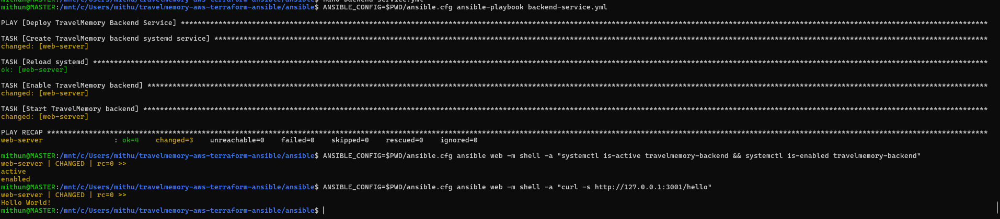

---

# 45. React Frontend Configuration

The frontend uses the backend base URL.

The application contains:

```javascript
export const baseUrl = process.env.REACT_APP_BACKEND_URL || "http://localhost:3001";
```

The production environment was configured using:

```env
REACT_APP_BACKEND_URL=http://13.234.111.87
```

This allows the React application to communicate with the public Nginx endpoint.

Screenshot:

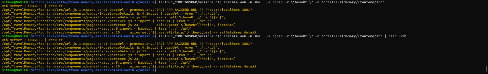

---

# 46. Frontend Environment

The frontend `.env` file was configured with:

```env
REACT_APP_BACKEND_URL=http://13.234.111.87
```

The `.env` file is excluded from Git.

Screenshot:

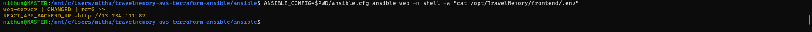

---

# 47. Frontend Dependencies

Frontend dependencies were installed:

```bash
cd /opt/TravelMemory/frontend
npm install
```

Screenshot:


---

# 48. React Production Build

The React production build was generated:

```bash
npm run build
```

The build completed successfully.

Warnings were present during the build, including:

- Unused variable warning
- JavaScript comparison warning
- Browserslist warning
- Create React App dependency warning

These warnings did not prevent the production build from completing.

Screenshot:

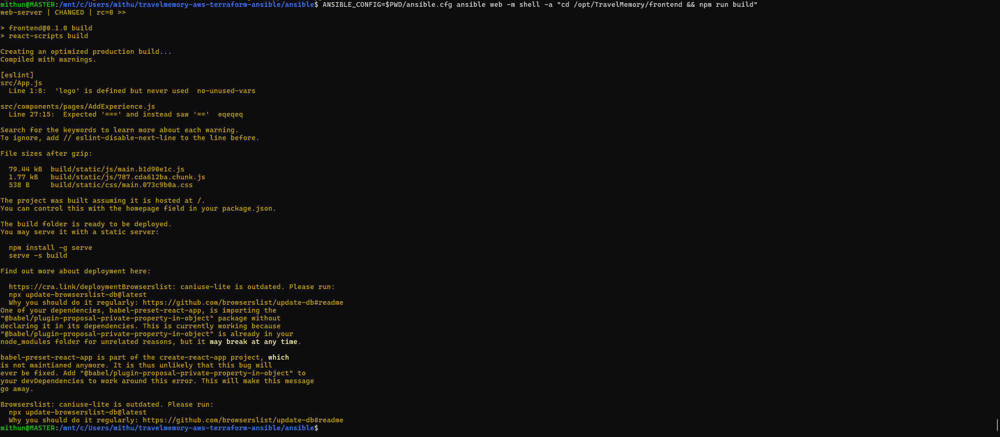

---

# 49. React Build Deployment

The production React build was copied to:

```text
/var/www/travelmemory
```

Nginx serves the files from this directory.

Screenshot:

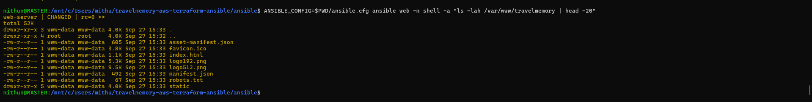

---

# 50. Nginx Installation

Nginx was installed on the Web EC2.

Nginx is used for two purposes:

1. Serve the React frontend.
2. Reverse proxy API requests to Node.js.

The architecture is:

```text
Browser
   |
   | HTTP :80
   v
Nginx
   |
   +----------------+
   |                |
   v                v
React             Node.js
Files             :3001
                     |
                     v
                  MongoDB
```

Screenshot:

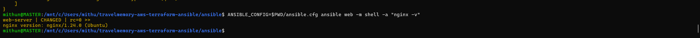

---

# 51. Nginx Configuration

The final Nginx configuration is:

```nginx
server {
    listen 80;
    listen [::]:80;

    server_name _;

    root /var/www/travelmemory;
    index index.html;

    location / {
        try_files $uri $uri/ /index.html;
    }

    location /trip {
        proxy_pass http://127.0.0.1:3001;
        proxy_http_version 1.1;

        proxy_set_header Host $host;
        proxy_set_header X-Real-IP $remote_addr;
        proxy_set_header X-Forwarded-For $proxy_add_x_forwarded_for;
        proxy_set_header X-Forwarded-Proto $scheme;
    }

    location /hello {
        proxy_pass http://127.0.0.1:3001;
        proxy_http_version 1.1;

        proxy_set_header Host $host;
        proxy_set_header X-Real-IP $remote_addr;
        proxy_set_header X-Forwarded-For $proxy_add_x_forwarded_for;
        proxy_set_header X-Forwarded-Proto $scheme;
    }
}
```

---

# 52. Nginx Configuration Validation

Nginx configuration was tested using:

```bash
sudo nginx -t
```

Expected result:

```text
nginx: the configuration file /etc/nginx/nginx.conf syntax is ok
nginx: configuration file /etc/nginx/nginx.conf test is successful
```

Screenshot:


---

# 53. Nginx Service

Nginx was verified as:

```text
Active: active (running)
Enabled: enabled
```

Screenshot:

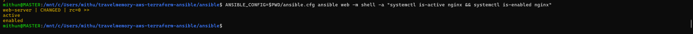

---

# 54. Public HTTP Test

The application is publicly accessible at:

```text
http://13.234.111.87
```

The server returned:

```text
HTTP/1.1 200 OK
```

Screenshot:

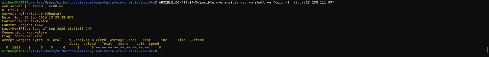

---

# 55. Nginx Reverse Proxy Test

The backend health endpoint was tested through Nginx:

```text
http://13.234.111.87/hello
```

Response:

```text
Hello World!
```

This confirms:

```text
Internet
   |
   v
Nginx
   |
   v
Node.js Backend
```

Screenshot:

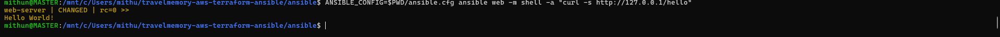

---

# 56. TravelMemory API Test

The TravelMemory API was tested through Nginx:

```text
http://13.234.111.87/trip/
```

The API successfully returned MongoDB records.

Screenshot:

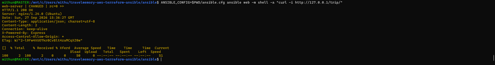

---

# 57. TravelMemory Frontend Test

The TravelMemory frontend was accessed using:

```text
http://13.234.111.87
```

The React application loaded successfully.

Screenshot:

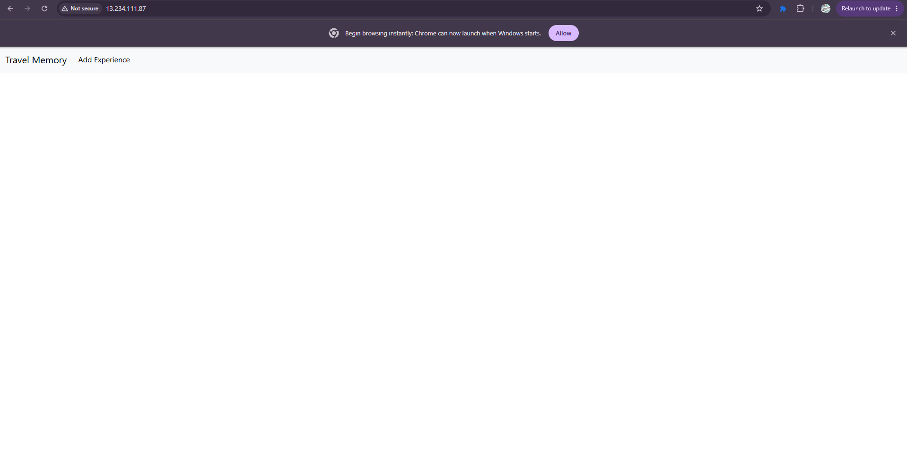

---

# 58. Add Experience Functional Test

The application's Add Experience functionality was tested through the frontend.

A test experience was submitted to verify the complete application workflow.

The workflow was:

```text
React Form
    |
    v
Nginx
    |
    v
Node.js / Express
    |
    v
Mongoose
    |
    v
MongoDB
```

Screenshot:


---

# 59. Add Experience Submission

The Add Experience form was successfully submitted.

Screenshot:

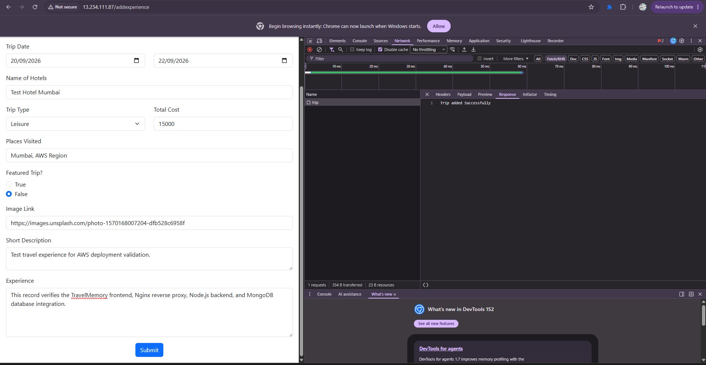

---

# 60. API Record Verification

After submitting the experience, the `/trip/` API was queried.

The newly created record was returned successfully.

Screenshot:

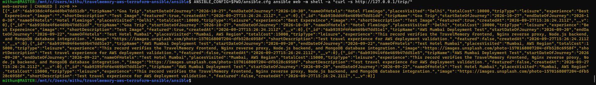

---

# 61. Frontend Record Verification

The stored TravelMemory record was successfully displayed by the React frontend.

Screenshot:

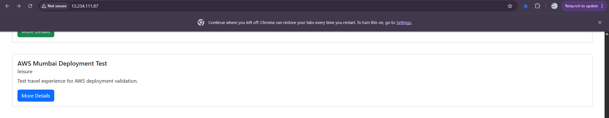

---

# 62. MongoDB Record Verification

The record was also verified directly inside MongoDB.

Database:

```text
travelmemory
```

Collection:

```text
tripdetails
```

This confirmed that the frontend request successfully reached the Node.js backend and was persisted in MongoDB.

Screenshot:

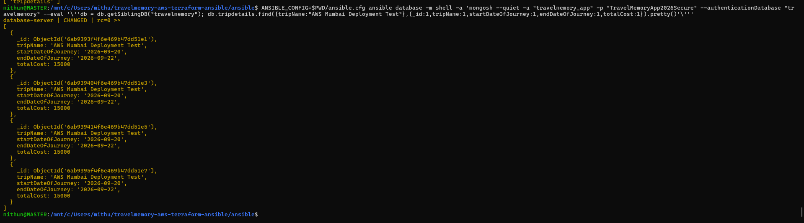

---

# 63. Test Data Cleanup

Temporary deployment test records were cleaned up after the functional test.

The original application data was retained.

The final application database was then verified again.

Screenshot:


---

# 64. Final API Validation

The final `/trip/` endpoint was tested after cleanup:

```text
http://13.234.111.87/trip/
```

The application returned the remaining TravelMemory records successfully.

Screenshot:


---

# 65. Final Service Validation

The following services were checked:

```text
MongoDB
Node.js Backend
Nginx
```

All required services were running.

Screenshot:


---

# 66. Security Configuration

The deployment includes multiple security controls.

## Network Isolation

The MongoDB server is located in a private subnet.

## Security Group Restriction

MongoDB port 27017 accepts connections only from the Web Security Group.

## MongoDB Authentication

MongoDB authentication is enabled.

## Dedicated Application User

The Node.js application uses a dedicated MongoDB user.

## No Public MongoDB Access

MongoDB is not exposed using a public IP.

## SSH Key Protection

The AWS private key is stored outside the Git repository.

## Environment File Protection

`.env` files are excluded from Git.

## Terraform State Protection

Terraform state files are excluded from Git.

---

# 67. Git Security

The project uses the following `.gitignore`:

```gitignore
# SSH/private keys
*.pem
*.key

# Environment/secrets
.env
*.env
vault.yml
vault.yaml

# Terraform
.terraform/
*.tfstate
*.tfstate.*
*.tfvars
*.tfvars.json
crash.log
crash.*.log

# Ansible
*.retry
__pycache__/
*.pyc

# Node.js
node_modules/
build/

# IDE / OS
.idea/
.vscode/
.DS_Store
Thumbs.db
```

Before committing, sensitive files were checked using:

```bash
git ls-files | grep -E '(\.pem$|\.key$|\.env$|\.tfstate$)'
```

No private key, environment or Terraform state files should be committed.

---

# 68. Private Key Verification

The project directory was checked for private keys:

```bash
find . -type f \( -name "*.pem" -o -name "*.key" \)
```

The AWS private key is stored outside the project directory.

Screenshot:


---

# 69. Git Project Root

The Git repository was initialized inside:

```text
/mnt/c/Users/mithu/travelmemory-aws-terraform-ansible
```

The Git root was verified using:

```bash
git rev-parse --show-toplevel
```

Expected result:

```text
/mnt/c/Users/mithu/travelmemory-aws-terraform-ansible
```

Screenshot:

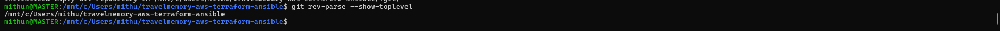

---

# 70. Final Git Secret Check

Sensitive files were checked before the final commit.

Command:

```bash
git ls-files | grep -E '(\.pem$|\.key$|\.env$|\.tfstate$)'
```

Expected result:

```text
No output
```

Screenshot:


---

# 71. Final Terraform Validation

The final Terraform configuration was validated:

```bash
terraform validate
```

Result:

```text
Success! The configuration is valid.
```

Screenshot:


---

# 72. Final Ansible Validation

Ansible was used to verify both servers:

```bash
ANSIBLE_CONFIG=$PWD/ansible.cfg ansible all -m ping
```

Both Web and Database servers returned successful responses.

Screenshot:


---

# 73. Git Repository

The final GitHub repository is:

https://github.com/Mithunvm92/travelmemory-aws-terraform-ansible

The repository contains:

```text
Terraform Infrastructure
Ansible Playbooks
Nginx Configuration
README Documentation
Screenshots
.gitignore
```

---

# 74. Git Commands

The repository can be committed using:

```bash
git add .

git commit -m "Deploy TravelMemory on AWS with Terraform and Ansible"
```

The main branch is:

```text
main
```

The remote repository can be configured using:

```bash
git remote add origin https://github.com/Mithunvm92/travelmemory-aws-terraform-ansible.git
```

Push:

```bash
git branch -M main
git push -u origin main
```

---

# 75. Final Application URL

The deployed TravelMemory application is available at:

```text
http://13.234.111.87
```

---

# 76. Final Infrastructure Summary

| Resource | Value |
|---|---|
| AWS Region | ap-south-1 |
| VPC | travelmemory-vpc |
| VPC CIDR | 10.0.0.0/16 |
| Public Subnet | travelmemory-public-subnet |
| Public Subnet CIDR | 10.0.1.0/24 |
| Private Subnet | travelmemory-private-subnet |
| Private Subnet CIDR | 10.0.2.0/24 |
| Web Instance | i-0fd292f4e61915386 |
| Web Private IP | 10.0.1.40 |
| Web Public IP | 13.234.111.87 |
| Database Instance | i-04cef62c1be6ff31a |
| Database Private IP | 10.0.2.54 |
| NAT Gateway | nat-0b62680f96b62327e |
| NAT Public IP | 16.4.10.144 |
| MongoDB Port | 27017 |
| Backend Port | 3001 |
| HTTP Port | 80 |
| MongoDB Version | 8.0.32 |
| Node.js Version | 20.20.2 |
| npm Version | 10.8.2 |
| Linux Kernel | 6.8.0-1064-aws |

---

# 77. Application Ports

| Component | Port | Access |
|---|---:|---|
| Nginx | 80 | Public |
| Node.js | 3001 | Local / Nginx |
| MongoDB | 27017 | Web Security Group only |
| SSH | 22 | Restricted administrator access |

---

# 78. End-to-End Application Flow

The final application flow is:

```text
                    USER
                      |
                      |
                      v
              Public Internet
                      |
                      | HTTP :80
                      v
                +-----------+
                |   NGINX   |
                +-----+-----+
                      |
             +--------+--------+
             |                 |
             v                 v
      React Frontend     Node.js Backend
                              |
                              | Port 3001
                              |
                              v
                         Mongoose
                              |
                              | TCP 27017
                              v
                      +---------------+
                      |    MongoDB    |
                      |  Private EC2  |
                      +---------------+
```

---

# 79. Security Architecture

```text
                         INTERNET
                            |
                            | HTTP :80
                            v
                    +---------------+
                    |     NGINX     |
                    |   WEB EC2      |
                    +-------+-------+
                            |
                            | Internal
                            v
                    +---------------+
                    | Node.js App   |
                    |    :3001      |
                    +-------+-------+
                            |
                            | TCP 27017
                            | Private Network
                            v
                    +---------------+
                    |   MongoDB     |
                    |    :27017     |
                    |  Private EC2  |
                    +---------------+
```

MongoDB is protected by:

```text
Private Subnet
+
Security Group
+
MongoDB Authentication
+
Application-specific User
```

---

# 80. Deployment Validation Checklist

| Validation | Status |
|---|---|
| AWS CLI authentication | PASS |
| Terraform initialization | PASS |
| Terraform validation | PASS |
| Terraform plan | PASS |
| Terraform apply | PASS |
| VPC | PASS |
| Public subnet | PASS |
| Private subnet | PASS |
| Internet Gateway | PASS |
| NAT Gateway | PASS |
| Public route table | PASS |
| Private route table | PASS |
| Web Security Group | PASS |
| Database Security Group | PASS |
| IAM configuration | PASS |
| Web EC2 | PASS |
| Database EC2 | PASS |
| SSH connectivity | PASS |
| Ansible connectivity | PASS |
| Node.js installation | PASS |
| npm installation | PASS |
| TravelMemory repository | PASS |
| Backend dependencies | PASS |
| MongoDB installation | PASS |
| MongoDB service | PASS |
| MongoDB authentication | PASS |
| MongoDB application user | PASS |
| Web-to-MongoDB connectivity | PASS |
| Backend systemd service | PASS |
| Backend API | PASS |
| React dependencies | PASS |
| React production build | PASS |
| Nginx installation | PASS |
| Nginx configuration | PASS |
| Nginx service | PASS |
| Nginx reverse proxy | PASS |
| Public HTTP | PASS |
| TravelMemory frontend | PASS |
| TravelMemory API | PASS |
| Database write | PASS |
| Database read | PASS |
| Final application validation | PASS |
| Git secret validation | PASS |

---

# 81. Screenshot Evidence

All screenshots are stored in:

```text
screenshots/
```

Important deployment screenshots:

### Infrastructure and Security


### MongoDB


### Application Connectivity


### Frontend


### Nginx


### TravelMemory Application


### Final Validation


---

# 82. Technologies Used

## Cloud

```text
Amazon Web Services
Amazon EC2
Amazon VPC
Internet Gateway
NAT Gateway
Security Groups
IAM
```

## Infrastructure as Code

```text
Terraform
```

## Configuration Management

```text
Ansible
```

## Operating System

```text
Ubuntu
```

## Web Server

```text
Nginx
```

## Backend

```text
Node.js
Express
Mongoose
```

## Frontend

```text
React
```

## Database

```text
MongoDB
```

## Version Control

```text
Git
GitHub
```

---

# 83. Key Learning Outcomes

This project demonstrates practical knowledge of:

- AWS VPC architecture
- Public and private subnet design
- Internet Gateway
- NAT Gateway
- AWS routing
- EC2 provisioning
- Security Groups
- IAM
- Terraform Infrastructure as Code
- Ansible configuration management
- Linux administration
- SSH
- Node.js deployment
- React production deployment
- MongoDB administration
- MongoDB authentication
- Nginx configuration
- Reverse proxy configuration
- systemd services
- Application troubleshooting
- Network troubleshooting
- Git security
- End-to-end application validation

---

# 84. Troubleshooting Performed

During the deployment, several real-world issues were identified and resolved.

## MongoDB Kernel Compatibility

MongoDB 8 was incompatible with the initial AWS kernel.

A compatible AWS 6.8 kernel was installed and configured.

Final kernel:

```text
6.8.0-1064-aws
```

## Backend npm Installation

The application directory ownership was corrected so that the Ubuntu application user could install backend dependencies.

## MongoDB Authentication

MongoDB authentication was enabled and a dedicated application user was configured.

## Private Database Connectivity

The Web EC2 connected to MongoDB using the private IP:

```text
10.0.2.54
```

## Nginx Reverse Proxy

Nginx was configured to forward:

```text
/trip
/hello
```

to the Node.js backend.

## React Backend URL

The React application was configured with:

```env
REACT_APP_BACKEND_URL=http://13.234.111.87
```

This allowed the production frontend to communicate with the backend through Nginx.

---

# 85. Final Result

The TravelMemory MERN application was successfully deployed on AWS using Terraform and Ansible.

The final architecture provides:

- Infrastructure as Code
- Automated server configuration
- Public Web/Application Server
- Private Database Server
- Network segmentation
- NAT-based private subnet Internet access
- MongoDB authentication
- Restricted MongoDB access
- Node.js backend service
- React frontend
- Nginx reverse proxy
- Automatic service startup
- Git-based project management
- Deployment documentation
- Screenshot-based evidence

The complete application workflow was successfully validated:

```text
React Frontend
      |
      v
    Nginx
      |
      v
Node.js / Express
      |
      v
    Mongoose
      |
      v
   MongoDB
```

---

# 86. Final Status

```text
========================================
       TRAVELMEMORY DEPLOYMENT
========================================

Terraform              : SUCCESS
AWS Infrastructure     : SUCCESS
VPC                    : SUCCESS
Public Subnet          : SUCCESS
Private Subnet         : SUCCESS
Internet Gateway       : SUCCESS
NAT Gateway            : SUCCESS
Route Tables           : SUCCESS
Security Groups        : SUCCESS
IAM                    : SUCCESS
EC2 Deployment         : SUCCESS
SSH Connectivity       : SUCCESS
Ansible Connectivity   : SUCCESS
Node.js                : SUCCESS
MongoDB                : SUCCESS
MongoDB Authentication : SUCCESS
Backend                : SUCCESS
React Frontend         : SUCCESS
Nginx                  : SUCCESS
Reverse Proxy          : SUCCESS
TravelMemory API       : SUCCESS
Database Connectivity  : SUCCESS
Database Write         : SUCCESS
Database Read          : SUCCESS
Application Test       : SUCCESS
Git Security           : SUCCESS
Final Validation       : SUCCESS

========================================
          DEPLOYMENT COMPLETE
========================================
```

---

# 87. Conclusion

This project demonstrates a complete DevOps deployment workflow for a MERN application on AWS.

Terraform was used to provision the AWS infrastructure, including the VPC, public and private subnets, Internet Gateway, NAT Gateway, route tables, Security Groups, IAM resources and EC2 instances.

Ansible was then used to configure the operating systems and application services.

The Web EC2 hosts the React frontend, Node.js backend and Nginx.

The MongoDB database is isolated inside a private subnet and is accessible only from the Web EC2 Security Group.

The final application was tested end-to-end, including:

```text
Frontend
   |
   v
Nginx
   |
   v
Node.js
   |
   v
MongoDB
```

The deployment successfully demonstrates:

- Infrastructure as Code
- Configuration Management
- Cloud Networking
- Security
- Application Deployment
- Database Deployment
- Reverse Proxy Configuration
- Service Management
- End-to-End Testing
- Git Security
- Technical Documentation

The TravelMemory application is successfully deployed and accessible through the public Web EC2 endpoint.

## Application

```text
http://13.234.111.87
```

## GitHub Repository

```text
https://github.com/Mithunvm92/travelmemory-aws-terraform-ansible
```

---
